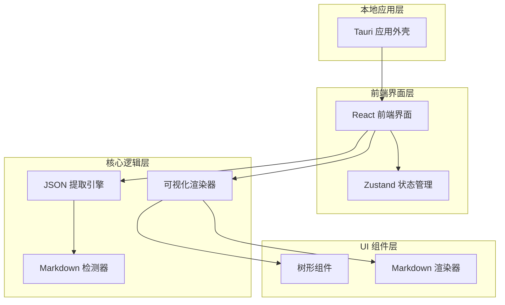
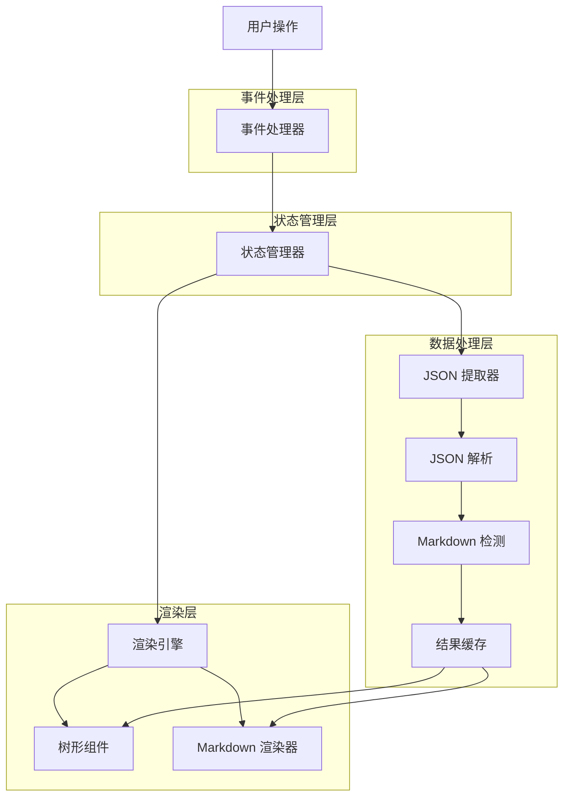

## 1. 架构设计



## 2. 技术描述

* **前端框架**: React\@18 + TypeScript + Vite

* **初始化工具**: vite-init

* **桌面应用包装**: Tauri\@2.0

* **UI 组件库**: Shadcn/ui + Radix UI

* **样式框架**: Tailwind CSS\@3

* **状态管理**: Zustand

* **Markdown 渲染**: react-markdown + remark-gfm

* **JSON 处理**: 原生 JSON API + 自定义提取算法

* **代码高亮**: Prism.js 或 highlight.js

* **快捷键**: react-hotkeys-hook

## 3. 路由定义

| 路由        | 用途              |
| --------- | --------------- |
| /         | 主界面，包含输入区域和结果展示 |
| /settings | 设置页面，配置主题、快捷键等  |
| /about    | 关于页面，显示应用信息和版本  |

## 4. 核心组件架构

### 4.1 JSON 提取引擎

```typescript
interface JSONExtractor {
  extractJSONBlocks(text: string): JSONBlock[]
  validateJSON(jsonStr: string): boolean
  findJSONBoundaries(text: string): Boundary[]
}

interface JSONBlock {
  id: string
  content: any
  startIndex: number
  endIndex: number
  size: number
  hasMarkdown: boolean
}
```

### 4.2 可视化渲染器

```typescript
interface JSONRenderer {
  renderTree(data: any): TreeNode
  detectMarkdown(value: string): boolean
  renderMarkdown(content: string): ReactNode
}

interface TreeNode {
  key: string
  value: any
  type: 'object' | 'array' | 'string' | 'number' | 'boolean' | 'null'
  children?: TreeNode[]
  isExpanded: boolean
  hasMarkdown: boolean
}
```

### 4.3 状态管理

```typescript
interface AppState {
  inputText: string
  jsonBlocks: JSONBlock[]
  selectedBlock: string | null
  expandedNodes: Set<string>
  history: HistoryState[]
  historyIndex: number
}

interface HistoryState {
  inputText: string
  jsonBlocks: JSONBlock[]
  timestamp: number
}
```

## 5. 应用架构图



## 6. 关键技术实现

### 6.1 JSON 提取算法

* 使用正则表达式匹配 JSON 边界

* 递归验证 JSON 结构完整性

* 支持嵌套 JSON 但不重复计数

* 处理转义字符和特殊格式

### 6.2 Markdown 检测策略

* 检测常见 Markdown 标记（#、\*、\` 等）

* 验证 Markdown 语法有效性

* 区分代码块和纯文本

* 支持 GitHub Flavored Markdown

### 6.3 性能优化

* 虚拟滚动处理大型 JSON 结构

* Web Worker 处理大文本解析

* 防抖处理实时输入

* 内存管理和垃圾回收

### 6.4 本地存储

* 使用 Tauri 的本地文件系统 API

* 支持拖拽文件到应用

* 剪贴板集成

* 应用设置持久化

## 7. 开发工具配置

### 7.1 构建配置

* Vite 配置优化打包体积

* Tauri 配置应用元数据

* TypeScript 严格模式

* ESLint + Prettier 代码规范

### 7.2 测试策略

* Jest 单元测试核心算法

* React Testing Library 测试组件

* Playwright 端到端测试

* 性能基准测试

### 7.3 打包发布

* 多平台构建（macOS、Windows、Linux）

* 代码签名和公证

* 自动更新机制

* 安装包优化

